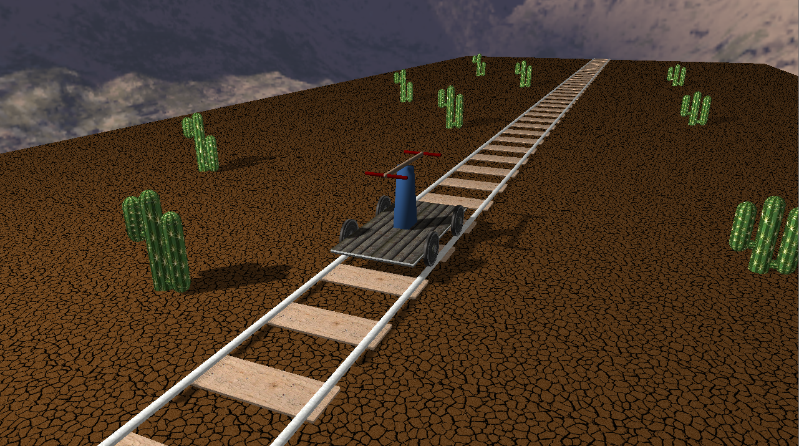

# ZT1-Drezyna
## Skład zespołu
    1 - Maciej Kapuściński
    2 - Denys Klochkov
    3 - Michał Kowieski
    
## Podział zadań
    1 - Maciej Kapuściński: podłoże, drezyna, tory, ruchy podłoża i drezyny, mapa cieni, teksturowanie
    2 - Denys Klochkov: prymitywy, kaktusiki, koła, poruszanie kamerą
    3 - Michał Kowieski: szkic architektury, cieniowanie
    
## Sterowanie
- Poruszanie kamerą: WASD, spacja, control
- Poruszanie drezyną: strzałki
- Przypięcie kamery do drezyny: c
- Zatrzymanie drezyny: x
    
## Punkty kontrolne
- [x] Stworzenie wstępnych punków kontrolnych | *estimate:* 0.5h | *spend:* 1.0h
- [x] Utworzenie prostego przykładowego projektu OpenGL | *estimate:* 1.0h | *spend:* 1.5h
- [x] Zaprojetowanie klas tworzących szablon struktóry projektu: | *estimate:* 20.0h |
    - [x] Application | *estimate:* 0.5h | *spend:* 0.5h
    - [x] Utilities | *estimate:* 0.5h | *spend:* 0.5h
    - [x] Debug | *estimate:* 0.5h | *spend:* 0.5h
    - [x] ArrayBuffer | *estimate:* 1.0h | *spend:* 1.0h
    - [x] VertexBufferLayout | *estimate:* 1.0h | *spend:* 2.0h
    - [x] IndexBuffer | *estimate:* 0.5h | *spend:* 0.5h
    - [x] VertexArray | *estimate:* 0.5h | *spend:* 0.5h
    - [x] Shader | *estimate:* 0.5h | *spend:* 0.5h
    - [x] Renderer | *estimate:* 0.5h | *spend:* 0.2h
    - [x] Texture | *estimate:* 0.5h | *spend:* 1.0h
    - [x] Projection | *estimate:* 1.5h | *spend:* 1.5h
    	- [x] PerspectiveProjection | *estimate:* 1.0h | *spend:* 0.5h
        - [x] OrtogonalProjection | *estimate:* 0.5h | *spend:* 0.5h
    - [x] View | *estimate:* 0.5h | *spend:* 0.1h
    	- [x] PositionFrontUpView | *estimate:* 1.0h | *spend:* 1.0h
    - [x] Model | *estimate:* 0.5h | *spend:* 0.3h
    - [x] TexturesMapper | *estimate:* 1.0h | *spend:* 1.75h
    - [x] Object, CompositeObject, ImplementedObject | *estimate:* 5.0h | *spend:* 8.0h
- [x] Stworzenie wstępnego szkicu projektu | *estimate:* 0.5h | *spend:* 0.75h
- [x] Zamodelowanie obiektów:
    - [x] Prymitywy:
        - [x] Trapez.h | *estimate:* 1.0h | *spend:* 1.5h
        - [x] Cube.h | *estimate:* 1.0h | *spend:* 2.0h
        - [x] Cylinder.h  | *estimate:* 2.0h | *spend:* 4.5h
        - [x] Sphere.h  | *estimate:* 2.0h | *spend:* 2.0h
    - [x] Drezyna:
        - [x] Koła
        - [x] Podstawa dzwigni
        - [x] Podwozie
        - [x] Dzwignia
    - [x] Podłoże
    - [x] Tory
    - [x] Tło
    - [x] Obiekty środowiska
    - [x] Ozdoby
- [x] Zaprogramowanie ruchu kamery  | *estimate:* 3.0h | *spend:* 4.0h
- [x] Zaprogramowanie ruchu obiektów:
    - [x] Drezyna: 
        - [x] Kóła | *estimate:* 1.0h | *spend:* 1.0h
        - [x] Podstawa dzwigni | *estimate:* 0 min | *spend:* 0 min
        - [x] Podwozie | *estimate:* 1.0h | *spend:* 1.0h
        - [x] Dzwignia | *estimate:* 2.0h | *spend:* 4.0h
    - [x] Podłoże | *estimate:* 1.0h | *spend:* 1.0h
- [x] Dodanie interakcji (obsługa klawiatury/myszki)
    - [x] Poruszanie kamerą | *estimate:* 1.0h | *spend:* 1.0h
    - [x] Tryb przypięcia kamery | *estimate:* 2.0h | *spend:* 1.5h
    - [x] Poruszanie drezyną | *estimate:* 2.0h | *spend:* 1.0h
- [x] Teksturowanie | *estimate:* 6.0h | *spend:* 6.0h
- [x] Stworzenie oświetlenia | *estimate:* 4.0h | *spend:* 6.0h
- [x] Stworzenie cieniowania | *estimate:* 6.0h | *spend:* 8.0h
- [x] Prezentacja gotowego projetku na spotkaniu nr 7

## Przykład
   
## Ostateczny render
   
